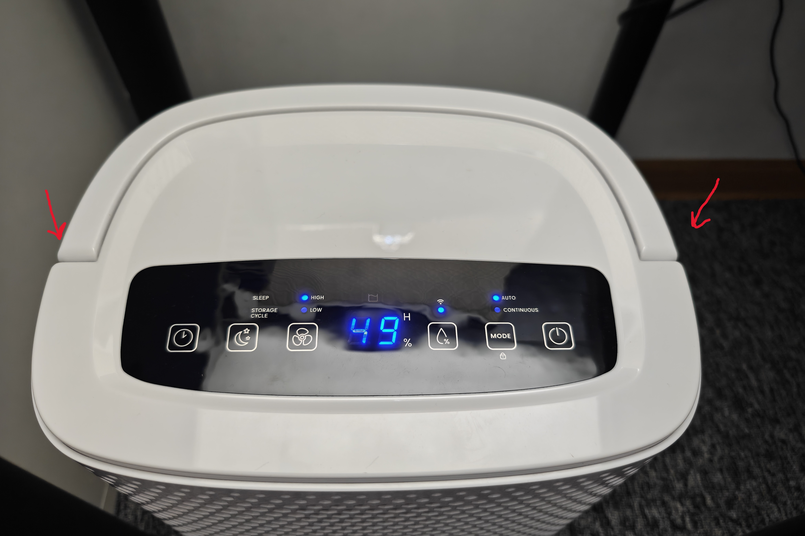

# ProBreeze-PB-D-06W-Dehumidifier-HA-mod
 Tuya cloud-cut modification for the ProBreeze PB-D-06W dehumidifier (Wi-Fi module replacement required!)

 Requirements:  
 Soldering iron  
 Esp32 (any, even esp8266 would work)  
 Home Assistant Server with esphome addon

 Internally, it originally houses a Realtek RTL8720CF (WBR1) or a similar chip.  
 Unfortunately, it is likely read-locked; moreover, these microcontrollers are not particularly pleasant to work with, so the best approach is to replace it with an ESP32.

 First, you need to open the dehumidifier's top cover, so remove the handle by twisting it and pulling it away from the unit's housing.

 

