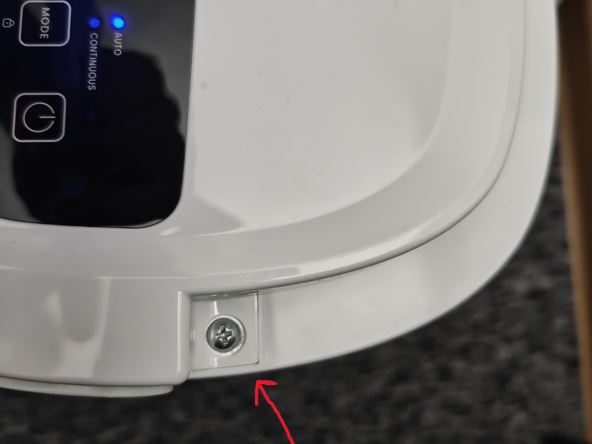
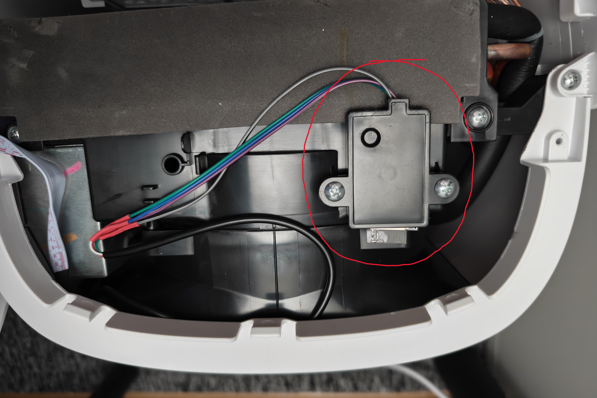
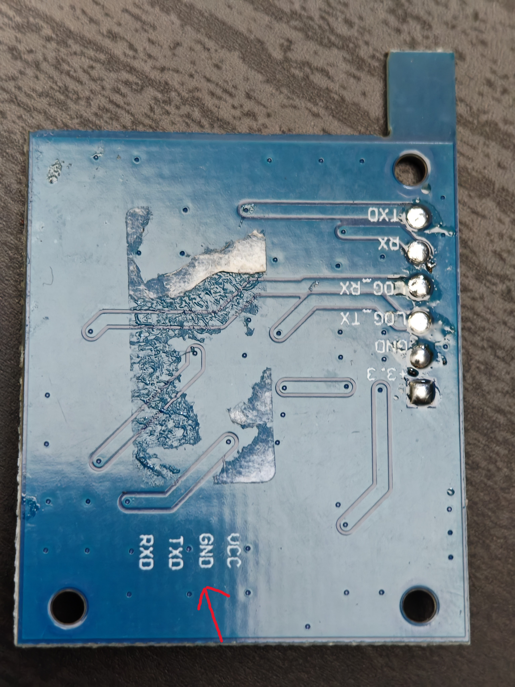

# ProBreeze-PB-D-06W-Dehumidifier-HA-mod
 Tuya cloud-cut modification for the ProBreeze PB-D-06W dehumidifier (Wi-Fi module replacement required!)

 !!! The dehumidifier does not lose its functionality, as the Wi-Fi module is merely an add-on; the unit is controlled by a microcontroller on the mainboard that communicates with the module via UART. !!!  

 Requirements:  
 Soldering iron  
 Esp32 (any, even esp8266 would work)  
 Home Assistant Server with esphome addon

 Internally, it originally houses a Realtek RTL8720CF (WBR1) or a similar chip.  
 Unfortunately, it is likely read-locked; moreover, these microcontrollers are not particularly pleasant to work with, so the best approach is to replace it with an ESP32.

 First, you need to open the dehumidifier's top cover, so remove the handle by twisting it and pulling it away from the unit's housing.

 

 Unscrew the screws visible on both sides after removing the handle.  
 The cover is still held in place by clips, so slide a flat-head screwdriver under the rear of the top panel and pry it up.  
 The panel should come loose, allowing you to open it.  

 

 After opening, you should see a small black box containing the Wi-Fi module (RTL8720CF); unscrew it and open it.

 

 
 After opening the unit, you should see a circuit board with a labeled 4-pin connector;  
 disconnect the cable attached to it and cut off the plastic connector. Solder the wires to the ESP32,  
 matching the wire colors and their original pinout from the connector.  

 
 
 After soldering, create a new device in ESPHome, then paste the code from the "esphome config" file below the `captive_portal` section and define the UART pins you selected.

 

 

 

